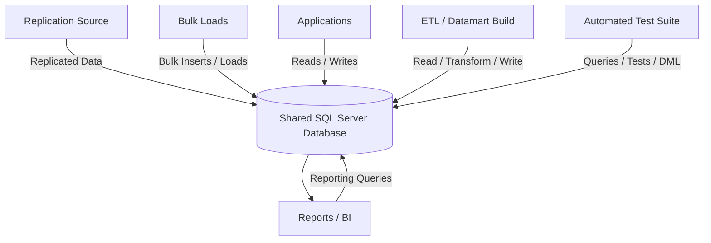
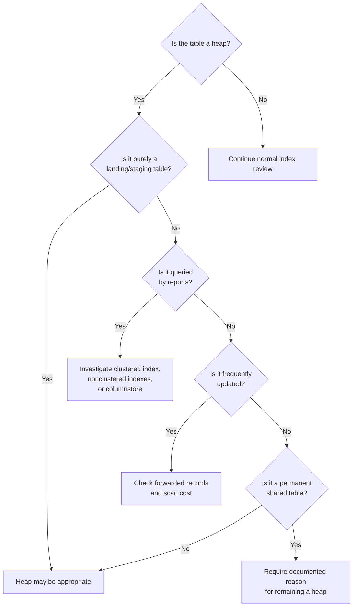
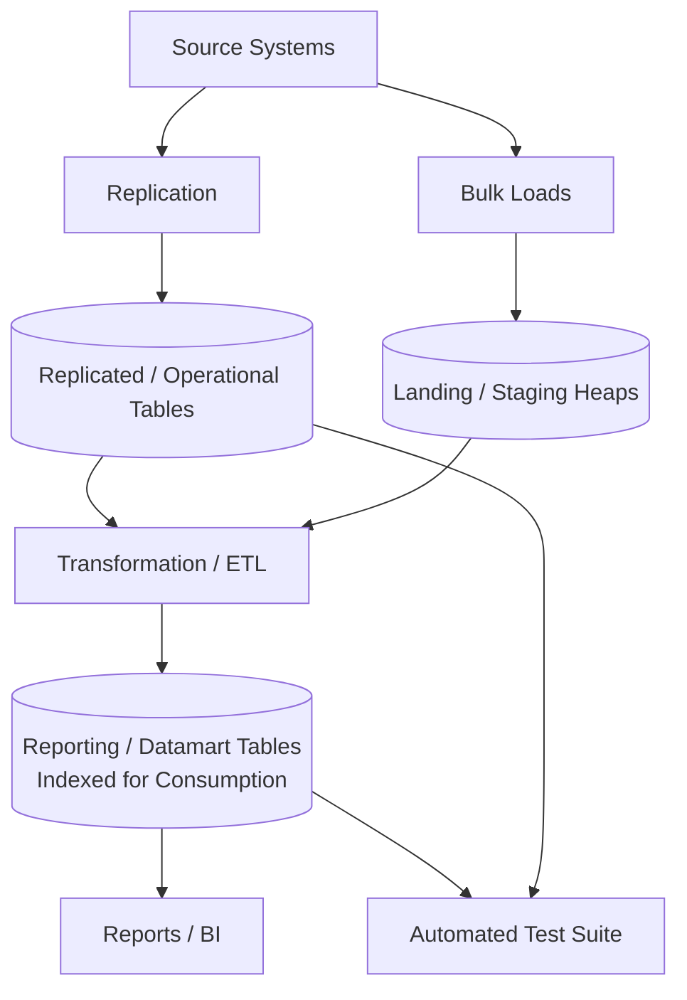
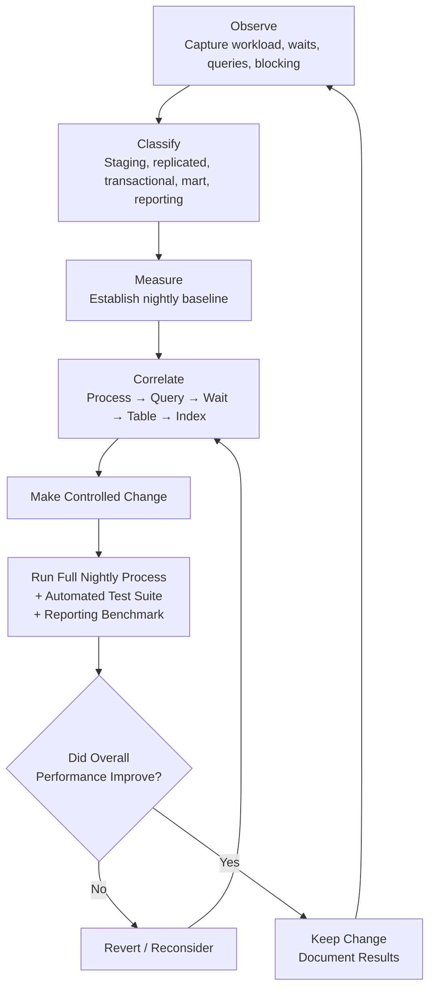

# SQL Server Performance Strategy for a Multi-Purpose Database

## Purpose

This document defines a practical strategy for analyzing and improving a SQL Server database that supports several competing workloads, including:

- Transactional or application tables
- Reporting tables
- Datamart tables
- Tables populated through SQL Server replication
- Tables populated through nightly bulk loads
- Tables intentionally implemented as heaps to improve load speed
- Nightly automated processes
- A full automated test suite
- Reporting workloads that may overlap with data-loading activity

The objective is **not** to add indexes everywhere.

The objective is to understand the complete workload, measure where time and resources are actually being consumed, classify tables according to their purpose, and then make deliberate physical-design and scheduling decisions.

> **Guiding principle:** Optimize the workload, not an individual query in isolation.

A faster report is not an improvement if it doubles the nightly load time. Likewise, a faster bulk load is not an improvement if users subsequently spend hours scanning a large unindexed heap.

---

# 1. The Core Problem

This database is serving several masters.



These workloads want different things.

### Bulk loading generally prefers

- Few indexes
- Sequential operations
- Large batches
- Minimal contention
- Minimal logging where possible
- Exclusive access when practical

### Reporting generally prefers

- Useful clustered or columnstore structures
- Selective nonclustered indexes
- Covering indexes
- Current statistics
- Predictable execution plans
- Low blocking
- Large memory grants when required

### Replication introduces another workload

- Continuous or scheduled writes
- Transaction-log activity
- Potential blocking
- Additional index-maintenance cost
- Potential overlap with ETL and reporting

### The automated test suite introduces yet another workload

- Reads
- Inserts
- Updates
- Deletes
- Stored-procedure executions
- Repeated business workflows

Trying to optimize all of these by simply creating indexes from SQL Server's missing-index recommendations will usually produce an unstable system.

---

# 2. The First Goal: Build a Workload Map

Before changing indexes, determine **who is using the database, when, and for what purpose**.

Create a workload inventory similar to this:

| Workload | Source | Typical Window | Reads | Writes | Tables | Priority |
|---|---|---:|---:|---:|---|---|
| Replication | Distributor/Publisher | Continuous/nightly | Low | High | Replicated tables | High |
| Bulk Import A | SQL Agent/SSIS | 23:00–00:30 | Medium | Very High | Staging | High |
| Bulk Import B | Vendor feed | 00:00–01:30 | Low | Very High | Staging/Mart | High |
| Datamart Build | SQL Agent | 01:00–03:00 | High | High | Fact/Dimension | High |
| Test Suite | CI/Test Runner | 02:00–05:00 | High | Medium | Many | High |
| Reporting | SSRS/Power BI/etc. | 05:00 onward | Very High | Low | Reporting/Mart | High |
| Maintenance | SQL Agent | TBD | High | High | Indexes/Stats | Medium |

The important information is not merely the individual runtimes.

The important question is:

> **Which workloads overlap?**

If three write-heavy operations execute simultaneously, indexing alone may not solve the problem.

Changing the schedule may provide a larger performance improvement than changing the schema.

---

# 3. Establish a Performance Baseline Before Making Changes

Do not begin by creating indexes.

First establish what a **normal nightly run** looks like.

Capture at least several representative nights if possible.

For each major process record:

| Metric | Capture |
|---|---|
| Start time | Yes |
| End time | Yes |
| Duration | Yes |
| Rows read | If available |
| Rows inserted | If available |
| Rows updated | If available |
| Rows deleted | If available |
| CPU | Yes |
| Logical reads | Yes |
| Physical reads | Yes |
| Writes | Yes |
| Waits | Yes |
| Blocking | Yes |
| Errors | Yes |
| Test failures | Yes |

At the end of this exercise you should be able to describe a normal night quantitatively.

Example:

```text
Replication
    23:00 - 04:00
    Normally 18M changes/night

Customer import
    23:30 - 00:15
    Normally 32M rows
    Average runtime: 41 minutes

Sales mart build
    00:30 - 02:10
    Reads 220M rows
    Average runtime: 96 minutes

Automated test suite
    02:00 - 04:20
    18,400 tests
    Average runtime: 137 minutes

Morning reporting
    Begins approximately 05:00
```

That becomes the baseline against which every optimization is evaluated.

---

# 4. Make Query Store the Historical Record

For this type of database, SQL Server Query Store should be one of the primary diagnostic tools.

Query Store maintains historical information about queries, execution plans, and runtime statistics. On supported SQL Server versions, it can also capture query-level wait categories.

Check the current configuration:

```sql
SELECT *
FROM sys.database_query_store_options;
```

If Query Store is not enabled, evaluate enabling it:

```sql
ALTER DATABASE [YourDatabase]
SET QUERY_STORE = ON
(
    OPERATION_MODE = READ_WRITE
);
```

For SQL Server versions that support Query Store wait statistics:

```sql
ALTER DATABASE [YourDatabase]
SET QUERY_STORE = ON
(
    WAIT_STATS_CAPTURE_MODE = ON
);
```

Do not configure Query Store once and forget about it. Monitor:

- Query Store size
- Capture policy
- Retention period
- Read/write status
- Number of captured queries
- Cleanup behavior

The goal is to retain enough history to compare:

- Good night vs. bad night
- Before index change vs. after index change
- Before release vs. after release

---

# 5. Inventory Every Process That Touches the Database

## SQL Server Agent Jobs

Start by identifying SQL Agent steps explicitly configured to use the database.

```sql
SELECT
    j.name AS job_name,
    js.step_id,
    js.step_name,
    js.subsystem,
    js.database_name,
    js.command
FROM msdb.dbo.sysjobs AS j
INNER JOIN msdb.dbo.sysjobsteps AS js
    ON j.job_id = js.job_id
WHERE
       js.database_name = N'YourDatabase'
    OR js.command LIKE N'%YourDatabase%'
ORDER BY
    j.name,
    js.step_id;
```

This query is only the beginning. It will not necessarily discover:

- External applications
- SSIS packages with external connection configuration
- Reporting tools
- PowerShell jobs
- Application servers
- CI/CD agents
- Test runners

Those should be added manually to the workload inventory.

---

# 6. See What Is Running Right Now

During a nightly run, capture active requests.

```sql
SELECT
    r.session_id,
    s.login_name,
    s.host_name,
    s.program_name,
    DB_NAME(r.database_id) AS database_name,
    r.status,
    r.command,
    r.cpu_time,
    r.total_elapsed_time,
    r.reads,
    r.writes,
    r.logical_reads,
    r.wait_type,
    r.wait_time,
    r.wait_resource,
    r.blocking_session_id,
    txt.text AS sql_text
FROM sys.dm_exec_requests AS r
INNER JOIN sys.dm_exec_sessions AS s
    ON r.session_id = s.session_id
CROSS APPLY sys.dm_exec_sql_text(r.sql_handle) AS txt
WHERE
    r.database_id = DB_ID(N'YourDatabase')
    AND r.session_id <> @@SPID
ORDER BY
    r.total_elapsed_time DESC;
```

This should be run several times during the nightly process, not once.

Ideally, automate snapshots.

---

# 7. Measure Blocking

Blocking is especially important when bulk loads, replication, test activity, and reports overlap.

A simple starting point is:

```sql
SELECT
    r.session_id,
    r.blocking_session_id,
    s.login_name,
    s.host_name,
    s.program_name,
    r.status,
    r.wait_type,
    r.wait_time,
    r.wait_resource,
    r.total_elapsed_time,
    txt.text AS sql_text
FROM sys.dm_exec_requests AS r
INNER JOIN sys.dm_exec_sessions AS s
    ON s.session_id = r.session_id
CROSS APPLY sys.dm_exec_sql_text(r.sql_handle) AS txt
WHERE
    r.blocking_session_id <> 0
ORDER BY
    r.wait_time DESC;
```

When blocking occurs, determine:

- Who is the blocker?
- Is it ETL?
- Replication?
- Test suite?
- Report?
- Index maintenance?
- What table/index is involved?
- How long is the transaction?
- Is the blocking repeated nightly?
- Can the workloads be scheduled differently?
- Can the query touch fewer rows?
- Can an index shorten the transaction?
- Is the transaction larger than it needs to be?

An index may solve some blocking problems simply by allowing a query to access 5,000 rows instead of scanning 50 million.

Other blocking problems are architectural or scheduling problems and should not be treated as indexing problems.

---

# 8. Analyze Wait Statistics

Wait statistics help answer:

> **What is SQL Server spending time waiting for?**

At the instance level:

```sql
SELECT TOP (50)
    wait_type,
    waiting_tasks_count,
    wait_time_ms,
    signal_wait_time_ms,
    max_wait_time_ms
FROM sys.dm_os_wait_stats
ORDER BY wait_time_ms DESC;
```

For nightly analysis, **deltas are much more useful than lifetime totals**.

Capture:

```text
Wait snapshot at 22:55
Wait snapshot at 05:00
```

Then calculate:

```text
Nightly waits = 05:00 counters - 22:55 counters
```

Do the same for individual phases when practical.

Typical wait families provide investigation directions rather than automatic diagnoses:

| Wait Family | Investigate |
|---|---|
| `PAGEIOLATCH_*` | Physical I/O, large scans, cache misses |
| `LCK_M_*` | Blocking and transaction concurrency |
| `WRITELOG` | Transaction-log throughput and transaction patterns |
| `RESOURCE_SEMAPHORE` | Query memory grants |
| `PAGELATCH_*` | In-memory page contention |
| `CXPACKET` / `CXCONSUMER` | Parallel query behavior |
| `ASYNC_NETWORK_IO` | Client/report consumption rate |

Correlate:

```text
Wait
  -> Query
     -> Execution plan
        -> Table/index
           -> Workload
              -> Time window
```

That is the diagnostic chain that matters.

---

# 9. Identify the Largest and Most Important Tables

Not every table deserves the same amount of attention.

Start with:

- Large tables
- Heavily modified tables
- Frequently scanned tables
- Tables appearing in slow Query Store queries
- Tables appearing in blocking chains
- Tables receiving missing-index recommendations
- Tables involved in several different workload types

Classify each important table.

Recommended classifications:

- `LANDING`
- `STAGING`
- `REPLICATED`
- `TRANSACTIONAL`
- `DATAMART_FACT`
- `DATAMART_DIMENSION`
- `REPORTING`
- `SHARED`
- `REFERENCE`

Example:

```text
dbo.CustomerStage
    Role: STAGING
    Source: Vendor bulk feed
    Loaded: nightly
    Reporting allowed: NO

dbo.SalesFact
    Role: DATAMART_FACT
    Source: Mart build
    Loaded: nightly
    Reporting allowed: YES

dbo.Customer
    Role: SHARED
    Source: Replication
    Test-suite access: YES
    Reporting access: YES
```

This classification will become extremely important when deciding whether a heap is appropriate.

---

# 10. Find Every Heap

A heap is simply a table without a clustered index.

Use:

```sql
SELECT
    s.name AS schema_name,
    t.name AS table_name,
    SUM(p.rows) AS row_count
FROM sys.tables AS t
INNER JOIN sys.schemas AS s
    ON s.schema_id = t.schema_id
INNER JOIN sys.indexes AS i
    ON i.object_id = t.object_id
    AND i.index_id = 0
INNER JOIN sys.partitions AS p
    ON p.object_id = i.object_id
    AND p.index_id = i.index_id
GROUP BY
    s.name,
    t.name
ORDER BY
    SUM(p.rows) DESC;
```

A heap should trigger a **classification decision**, not an automatic `CREATE CLUSTERED INDEX`.



A useful organizational rule is:

> **Every large permanent heap should have an explicit reason for being a heap.**

---

# 11. Separate Staging Design from Reporting Design

This is likely one of the highest-value changes available.

Do not make one physical table serve both as:

- The fastest possible bulk-load target
- The fastest possible reporting structure

unless measurements demonstrate that it can perform both roles adequately.

A cleaner design is:



The staging table can remain optimized for ingestion.

The reporting table can remain optimized for reads.

This prevents a constant argument between:

- "Drop the index because loading is slow"
- "Add the index because reporting is slow"

Both requirements can be correct. The mistake is forcing them onto the same physical structure unnecessarily.

---

# 12. Bulk Loading: Do Not Assume "No Indexes" Is Always Best

Indexes increase modification cost because SQL Server must maintain them as data changes.

At the same time, the absence of indexes can make downstream processing dramatically more expensive.

Bulk-load design should therefore consider the **entire pipeline**:

```text
Load
+
Transform
+
Validate
+
Test
+
Report
=
Total workload cost
```

Example:

```text
Design A

Bulk load:       15 minutes
Transformation:  80 minutes
Reports:         70 minutes

Total:          165 minutes
```

versus:

```text
Design B

Bulk load:       25 minutes
Transformation:  25 minutes
Reports:         10 minutes

Total:           60 minutes
```

A slower import can still produce a substantially faster system.

---

# 13. Find Missing Index Recommendations

SQL Server exposes missing-index information through DMVs.

A useful starting query is:

```sql
SELECT TOP (50)
    DB_NAME(mid.database_id) AS database_name,
    OBJECT_SCHEMA_NAME(mid.object_id, mid.database_id) AS schema_name,
    OBJECT_NAME(mid.object_id, mid.database_id) AS table_name,

    migs.user_seeks,
    migs.user_scans,
    migs.avg_total_user_cost,
    migs.avg_user_impact,

    CONVERT(decimal(18,2),
        migs.avg_total_user_cost
        * (migs.avg_user_impact / 100.0)
        * (migs.user_seeks + migs.user_scans)
    ) AS estimated_improvement_score,

    mid.equality_columns,
    mid.inequality_columns,
    mid.included_columns,

    migs.last_user_seek,
    migs.last_user_scan
FROM sys.dm_db_missing_index_group_stats AS migs
INNER JOIN sys.dm_db_missing_index_groups AS mig
    ON mig.index_group_handle = migs.group_handle
INNER JOIN sys.dm_db_missing_index_details AS mid
    ON mid.index_handle = mig.index_handle
WHERE
    mid.database_id = DB_ID()
ORDER BY
    estimated_improvement_score DESC;
```

This gives a prioritized **investigation list**.

It does **not** give a list of indexes that should automatically be created.

> **Missing-index DMVs are evidence, not instructions.**

---

# 14. Evaluate Missing Indexes Properly

For each high-value recommendation:

## Step 1 — Find the query

Determine which report, stored procedure, ETL statement, or test is requesting the index.

## Step 2 — Inspect the actual execution plan

Determine whether the expensive operation is actually:

- Table scan
- Clustered index scan
- Key lookup
- Hash join
- Sort
- Spill
- Bad cardinality estimate
- Non-SARGable predicate
- Parameter-sensitive plan
- Blocking rather than execution cost

## Step 3 — Inspect existing indexes

A suggested index such as:

```sql
CREATE INDEX IX_Example
ON dbo.Sales
(
    CustomerId,
    OrderDate
)
INCLUDE
(
    Amount,
    Status
);
```

may already be mostly covered by:

```sql
CREATE INDEX IX_Sales_Customer_OrderDate
ON dbo.Sales
(
    CustomerId,
    OrderDate,
    RegionId
)
INCLUDE
(
    Amount,
    Status,
    SalesPersonId
);
```

Creating both may simply create redundant write overhead.

## Step 4 — Estimate write cost

Ask:

- How frequently is this table loaded?
- How many rows change nightly?
- Does replication modify it?
- Does the test suite heavily update it?
- Will another index materially increase load time?

## Step 5 — Test it

Create the candidate index in the test environment.

Then run:

- The complete nightly process
- The complete automated test suite
- Representative reporting workload

Measure the result.

---

# 15. Analyze Existing Index Usage

SQL Server tracks usage information for indexes.

```sql
SELECT
    s.name AS schema_name,
    t.name AS table_name,
    i.name AS index_name,
    i.index_id,

    COALESCE(us.user_seeks, 0) AS user_seeks,
    COALESCE(us.user_scans, 0) AS user_scans,
    COALESCE(us.user_lookups, 0) AS user_lookups,
    COALESCE(us.user_updates, 0) AS user_updates,

    us.last_user_seek,
    us.last_user_scan,
    us.last_user_lookup,
    us.last_user_update
FROM sys.indexes AS i
INNER JOIN sys.tables AS t
    ON t.object_id = i.object_id
INNER JOIN sys.schemas AS s
    ON s.schema_id = t.schema_id
LEFT JOIN sys.dm_db_index_usage_stats AS us
    ON us.database_id = DB_ID()
    AND us.object_id = i.object_id
    AND us.index_id = i.index_id
WHERE
    i.index_id > 0
ORDER BY
    COALESCE(us.user_updates, 0) DESC;
```

The purpose is to locate indexes with patterns such as:

```text
Reads:      almost none
Updates:    millions
```

Those indexes deserve investigation.

Do not automatically drop them.

An index could support:

- A monthly report
- A quarterly process
- An emergency workflow
- A foreign-key access path
- An infrequent but business-critical query

Capture index-usage snapshots over a representative business period instead of inspecting the DMV once and making permanent decisions.

---

# 16. Create an Index Scorecard

For important indexes, maintain something similar to:

| Table | Index | Seeks | Scans | Lookups | Updates | Size | Purpose | Decision |
|---|---|---:|---:|---:|---:|---:|---|---|
| Sales | IX_Customer | 8.2M | 40K | 0 | 12M | 18 GB | Reports | Keep |
| Sales | IX_OldStatus | 4 | 0 | 0 | 12M | 9 GB | Unknown | Investigate |
| Orders | IX_OrderDate | 3.1M | 70K | 0 | 5M | 11 GB | Reports | Keep |
| StageX | IX_SourceId | 0 | 0 | 0 | 30M | 7 GB | Legacy | Candidate removal |

This turns index maintenance from guesswork into an auditable process.

---

# 17. Choose Clustered Indexes Deliberately

For permanent rowstore tables, clustered-index design should reflect how the table is accessed.

A good clustered key is usually:

- Relatively narrow
- Stable
- Frequently useful for accessing the data
- Preferably unique
- Often, but not always, ever-increasing

Do **not** assume:

```text
Primary Key = Automatically the ideal clustered index
```

The primary key and clustered index are separate design decisions.

Design based on the workload.

---

# 18. Consider Columnstore for Large Reporting Tables

For genuinely analytical tables, especially large fact-style tables used primarily for scanning and aggregation, columnstore should be evaluated.

Potential candidates include tables supporting queries such as:

```sql
SELECT
    Region,
    ProductCategory,
    SUM(NetSales),
    SUM(Units)
FROM dbo.SalesFact
WHERE BusinessDate >= '2026-01-01'
GROUP BY
    Region,
    ProductCategory;
```

Do not convert tables to columnstore simply because they are large.

Test:

- Load speed
- Query speed
- Compression
- Update pattern
- Memory use
- CPU
- Test-suite behavior

Columnstore is another design option, not a universal replacement for rowstore indexes.

---

# 19. Use Covering Indexes Carefully

For important high-frequency reports, a nonclustered index can sometimes eliminate large numbers of lookups by including columns required by the query.

Example:

```sql
CREATE INDEX IX_Order_Customer_OrderDate
ON dbo.[Order]
(
    CustomerId,
    OrderDate
)
INCLUDE
(
    Status,
    TotalAmount
);
```

Covering every report independently often creates an index explosion.

Prefer:

> One carefully designed index supporting several important queries

over:

> Ten nearly identical indexes generated from ten missing-index warnings

---

# 20. Statistics Are Part of the Nightly Pipeline

After loading large quantities of data, query performance can be poor even when the correct indexes exist if optimizer statistics no longer represent the data well.

For large nightly loads, evaluate whether selected statistics should be refreshed between:

```text
LOAD
   |
   v
STATISTICS
   |
   v
REPORT / TEST
```

rather than blindly executing:

```sql
UPDATE STATISTICS EveryTable WITH FULLSCAN;
```

every night.

Measure the benefit.

---

# 21. Treat Replication as a First-Class Workload

Replication should appear explicitly in performance analysis rather than being regarded as infrastructure noise.

Record:

- Replication latency
- Commands delivered
- Agent runtime
- Failure/retry events
- Blocking
- Transaction-log activity
- Tables being modified
- Overlap with ETL
- Overlap with test execution

A reporting index added to a replicated destination may improve reporting while increasing modification work against that table.

That trade-off should be measured.

---

# 22. Do Not Start with Fragmentation

A common tuning mistake is:

```text
Database slow
    ->
Check fragmentation
    ->
Rebuild every index
```

That is not the recommended starting point for this environment.

First determine:

1. Which processes are slow?
2. Which queries are slow?
3. What are they waiting on?
4. Which tables are involved?
5. What access paths are being used?
6. Are workloads colliding?

Only then investigate physical index condition where relevant.

---

# 23. Make the Automated Test Suite Part of Performance Tuning

The existence of a complete nightly test suite is a major advantage.

Use it as a controlled experiment.

For every significant physical-design change:

```text
Baseline
   |
   v
Make ONE logical group of changes
   |
   v
Run entire nightly pipeline
   |
   v
Run complete test suite
   |
   v
Run reporting benchmark
   |
   v
Compare
```

Capture:

| Metric | Before | After | Change |
|---|---:|---:|---:|
| Bulk load | 42 min | 47 min | +5 |
| Replication latency | 8 sec | 10 sec | +2 |
| Mart build | 91 min | 54 min | -37 |
| Tests | 138 min | 121 min | -17 |
| Report A | 54 sec | 4 sec | -50 |
| Report B | 22 sec | 3 sec | -19 |
| Overall nightly window | 5h 20m | 4h 11m | -1h 09m |

This is the measurement that matters.

An index that makes one query 90% faster but increases the overall nightly window by an hour may be a poor trade.

---

# 24. Define Performance Gates

Turn the test environment into a performance laboratory.

Example gates:

```text
Bulk Customer load
    Must complete <= 45 minutes

Replication latency
    Must remain <= 30 seconds during normal operation

Mart build
    Must complete <= 90 minutes

Automated test suite
    Must complete <= 150 minutes

Critical Report A
    Must complete <= 10 seconds

Critical Report B
    Must complete <= 20 seconds

Total nightly processing window
    Must complete <= 05:00
```

Then an index or code change is evaluated against the entire system.

---

# 25. Recommended Investigation Order

## Phase 1 — Inventory

Document:

- SQL Agent jobs
- Replication jobs/agents
- Bulk loaders
- ETL
- Stored procedures
- Reporting applications
- Test-suite applications
- Application servers
- Maintenance

Determine their schedules and dependencies.

## Phase 2 — Enable Historical Observability

Establish:

- Query Store
- Query Store wait capture where supported
- Nightly job-duration history
- Index-usage snapshots
- Wait-stat snapshots
- Blocking capture
- Replication monitoring

Do this **before major tuning changes**.

## Phase 3 — Classify Tables

Every significant table should become one of:

- Landing
- Staging
- Operational
- Replicated
- Shared
- Reporting
- Datamart Fact
- Datamart Dimension
- Reference

Pay particular attention to large heaps.

## Phase 4 — Find the Expensive Queries

Use Query Store to rank queries by:

- Total duration
- Average duration
- CPU
- Logical reads
- Physical reads
- Writes
- Execution count
- Wait time

Do this specifically for the nightly window.

## Phase 5 — Find Workload Collisions

Determine whether:

- Bulk Load
- Replication
- Mart Build
- Tests
- Reports

are competing simultaneously.

Try scheduling changes before expensive structural redesign where possible.

## Phase 6 — Review Heaps

Use the heap decision tree above for every large heap.

## Phase 7 — Review Missing Indexes

For the highest-value candidates:

```text
Find query
-> inspect plan
-> inspect current indexes
-> consolidate recommendations
-> estimate write cost
-> test
```

Never bulk-create the entire missing-index DMV output.

## Phase 8 — Review Existing Indexes

Identify:

- High-read / high-write indexes
- High-read / low-write indexes
- Low-read / high-write indexes
- Duplicate indexes
- Overlapping indexes
- Large indexes
- Unknown-purpose indexes

## Phase 9 — Evaluate Reporting Structures

For reporting-heavy tables consider:

- Clustered rowstore
- Nonclustered covering indexes
- Filtered indexes
- Clustered columnstore
- Nonclustered columnstore
- Separate reporting tables

## Phase 10 — Run the Entire Nightly Benchmark

For every meaningful change run:

- Replication
- Bulk loads
- ETL
- Datamart builds
- Tests
- Representative reporting

Do not benchmark only the query that motivated the change.

---

# 26. Target Architecture

The eventual architecture should move toward clearer workload boundaries.


The key boundary is:

> **Tables optimized for ingestion are not necessarily the same tables that should be optimized for consumption.**

They can occasionally be the same table, but that should be a deliberate decision rather than an accident of history.

---

# 27. Practical Rule for Index Changes

Before creating an index, answer five questions.

## 1. Which workload needs it?

Example:

```text
Morning Sales Report
```

## 2. Which query needs it?

Record the Query Store query ID or stored procedure.

## 3. What current problem does it solve?

Example:

```text
82M-row scan
14 GB logical reads
43-second execution
```

## 4. What does it cost?

Example:

```text
9 GB additional storage
12M nightly rows must maintain index
Bulk load increases by 6 minutes
```

## 5. Did the complete workload improve?

Example:

```text
Report:
43 sec -> 2 sec

Bulk:
32 min -> 38 min

Nightly pipeline:
4h 20m -> 3h 51m

Decision:
KEEP
```

If these questions cannot be answered, the index change is not yet justified.

---

# 28. Performance Change Log

Maintain a table or wiki page such as:

| Date | Change | Reason | Load Impact | Test Impact | Report Impact | Decision |
|---|---|---|---|---|---|---|
| 2026-08-01 | Added IX_Sales_Date | Report A | +2 min | -4 min | 41s → 3s | Keep |
| 2026-08-04 | Removed IX_OldStatus | Unused | -3 min | None | None | Keep removed |
| 2026-08-07 | Added clustered index to X | Heap scans | +8 min | -20 min | 70s → 8s | Keep |

This prevents the database from slowly accumulating indexes whose original purpose nobody remembers.

---

# 29. What Not to Do

Avoid the following approaches:

- Do not add every missing index SQL Server recommends.
- Do not create clustered indexes on every heap merely because they are heaps.
- Do not keep every heap merely because bulk loading is faster.
- Do not drop an index based on one index-usage snapshot.
- Do not optimize reporting without measuring load impact.
- Do not optimize loading without measuring reporting impact.
- Do not rebuild every index simply because fragmentation exists.
- Do not treat server-wide waits as proof of a particular query problem.
- Do not tune production before establishing a baseline.
- Do not evaluate changes using one query when the database supports many workloads.
- Do not ignore scheduling and concurrency while focusing exclusively on indexes.

---

# 30. The Most Important Metrics

The eventual monitoring dashboard does not need hundreds of metrics.

Start with these.

## Overall

- Nightly processing start
- Nightly processing finish
- Total nightly duration
- CPU utilization
- I/O throughput/latency
- Transaction-log activity
- Blocking duration

## Workload

- Process duration
- Rows processed
- CPU
- Reads
- Writes
- Waits
- Failures

## Query

- Execution count
- Average duration
- Total duration
- CPU
- Logical reads
- Physical reads
- Writes
- Wait category
- Plan changes

## Index

- Seeks
- Scans
- Lookups
- Updates
- Size
- Last usage
- Missing-index demand

## Replication

- Latency
- Throughput
- Agent failures
- Blocking

## Testing

- Total suite duration
- Individual slow tests
- Failures
- Performance regressions

---

# 31. Suggested 30-Day Tuning Program

## Week 1 — Observe

Do not make major index changes.

Build:

- Workload inventory
- Job schedule
- Table classifications
- Heap inventory
- Query Store history
- Index usage baseline
- Wait-stat snapshots
- Blocking capture
- Replication baseline

The deliverable is a map of the database.

## Week 2 — Identify the Top Problems

Rank:

- Top 20 queries by total duration
- Top 20 by CPU
- Top 20 by logical reads
- Top blocking chains
- Top wait categories
- Top missing-index recommendations
- Largest heaps
- Most write-expensive indexes

Identify approximately five to ten high-value tuning targets.

Do not try to fix everything.

## Week 3 — Controlled Changes

For each target:

```text
Problem
-> hypothesis
-> change
-> full nightly test
-> measurements
-> keep/revert
```

Typical changes may include:

- Adding one consolidated nonclustered index
- Changing a heap into an indexed reporting table
- Keeping a staging table as a heap
- Moving reporting away from a staging table
- Removing a proven unused index
- Changing job schedules
- Updating statistics after a large load
- Changing a clustered-index design
- Testing columnstore on a reporting fact table
- Rewriting a high-read query

## Week 4 — Standardize

Document the resulting rules.

Example:

```text
RULE 1
Landing tables may be heaps.

RULE 2
Reports may not query landing tables directly.

RULE 3
Permanent heaps require documented justification.

RULE 4
Every new index requires a workload owner and supporting query.

RULE 5
Missing-index recommendations must be consolidated with existing indexes.

RULE 6
Indexes cannot be dropped using DMV usage data from a single observation.

RULE 7
Performance changes require the complete nightly test suite.

RULE 8
Nightly pipeline duration is the primary system-level benchmark.

RULE 9
Query Store is the authoritative historical query-performance source.

RULE 10
Performance changes must be recorded in the performance change log.
```

---

# 32. Definition of Success

The final objective is not:

- Zero heaps
- Zero missing indexes
- Zero scans
- The fastest possible report

Success means:

- Reliable replication
- Fast enough ingestion
- Predictable datamart construction
- Acceptable test-suite duration
- Fast reporting
- Controlled blocking
- Stable execution plans
- Manageable indexes
- A predictable nightly completion time

The database should become predictable.

When a night runs slowly, the team should be able to determine:

- What changed?
- Which workload slowed down?
- Which query caused it?
- What was it waiting on?
- Which table/index was involved?
- Was another workload competing with it?
- Was there a plan change?
- Did replication contribute?
- Did the amount of data change?

That is a much more valuable outcome than simply having a large collection of indexes.

---

# 33. Recommended First Actions

For this particular environment, the first practical actions should be:

1. **Enable or validate Query Store** and make sure enough history is retained to cover multiple nightly runs.
2. **Inventory all SQL Agent, replication, ETL, bulk-load, reporting, and test-suite processes** and place them on one timeline.
3. **Capture start/end wait-stat snapshots** around the complete nightly processing window.
4. **Inventory all heaps**, rank them by size, and classify each one as legitimate staging or a permanent/shared/reporting table requiring review.
5. **Capture existing index usage for several representative nightly runs** rather than making decisions from one snapshot.
6. **Capture and rank missing-index recommendations**, but treat them as tuning leads rather than `CREATE INDEX` scripts.
7. **Use Query Store to identify the top queries during the nightly window** by total duration, CPU, logical reads, execution count, and waits.
8. **Correlate the expensive queries to specific processes and tables.**
9. **Look for workload collisions before redesigning tables.**
10. **Select the first five high-value tuning changes**, run the complete nightly workload and full test suite, and record the before/after measurements.

---

# 34. Performance-Tuning Lifecycle

Use the following cycle for every tuning effort:



---

# Final Principle

The most important change is methodological.

Instead of asking:

> Which indexes are missing?

ask:

- What is this database doing during the night?
- Which workloads compete?
- Where does the time go?
- What is SQL Server waiting for?
- Which queries consume the resources?
- Which physical structures support those queries?
- What does each structure cost the write workloads?
- Can staging and reporting responsibilities be separated?
- Did the entire nightly workload improve after the change?

Once those questions are measurable, index design becomes much easier.

The strategy is:

**Observe → Classify → Measure → Correlate → Change → Run Full Nightly Test → Compare → Keep or Revert**

That creates a database whose performance can be explained, tested, and improved systematically instead of being tuned through accumulated one-off fixes.
